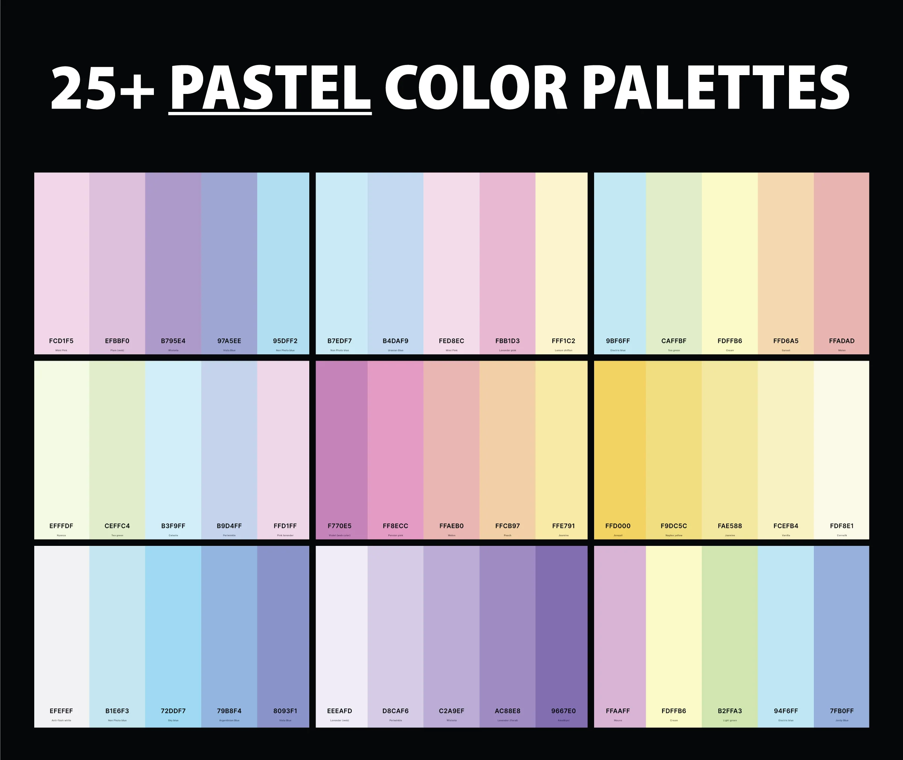
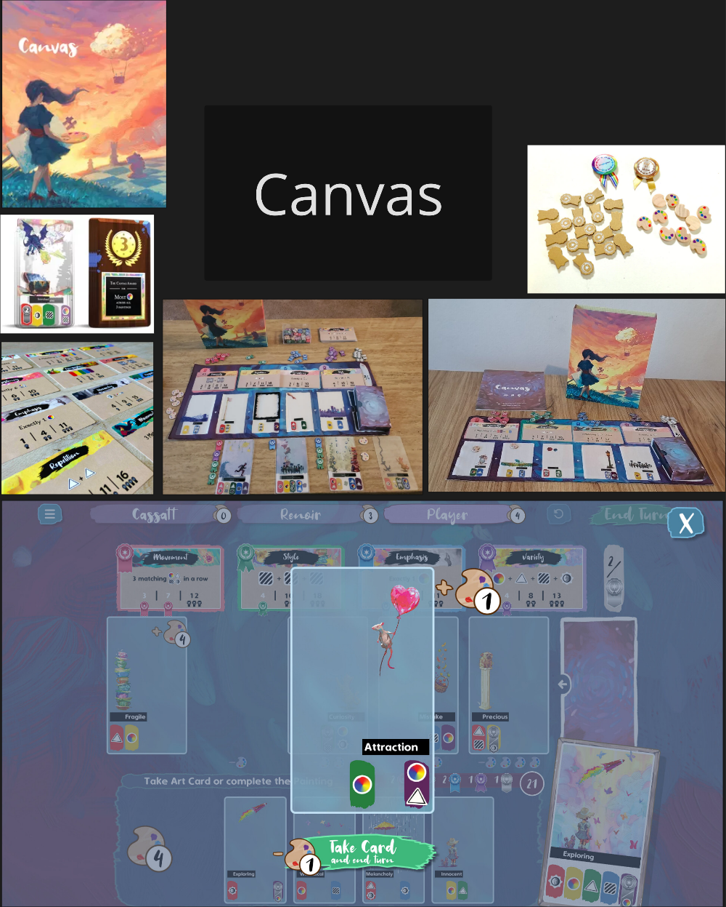
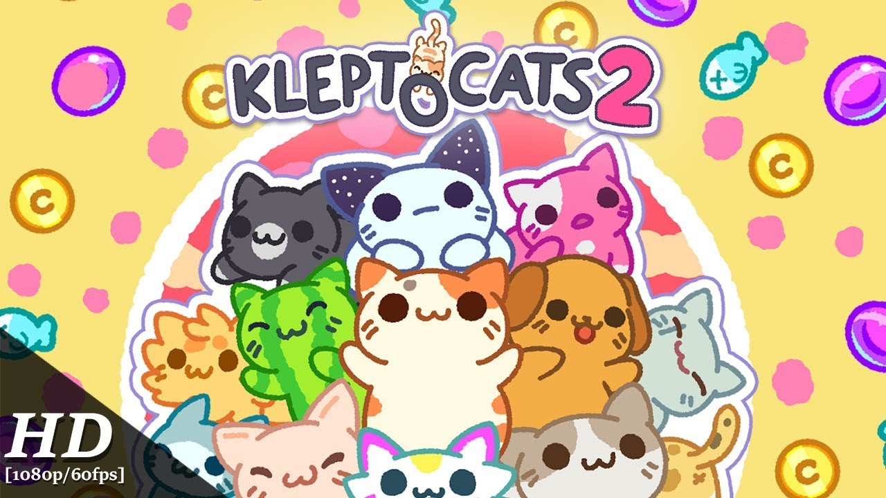
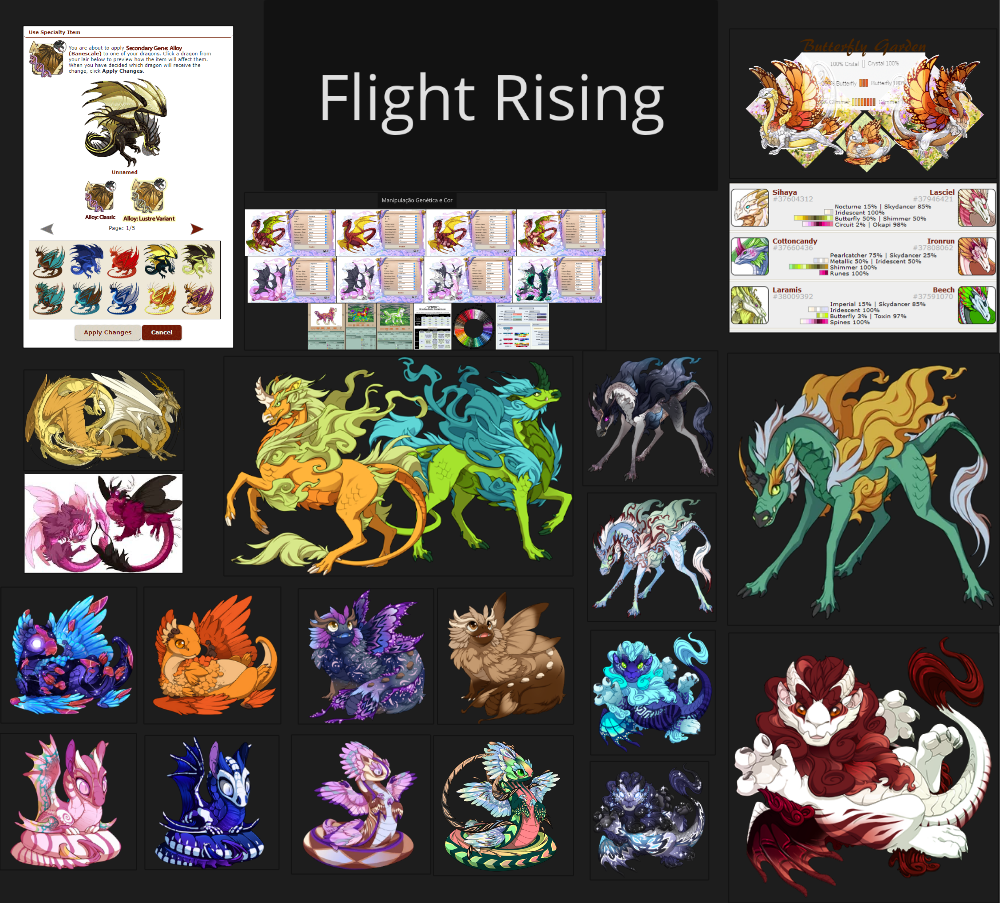
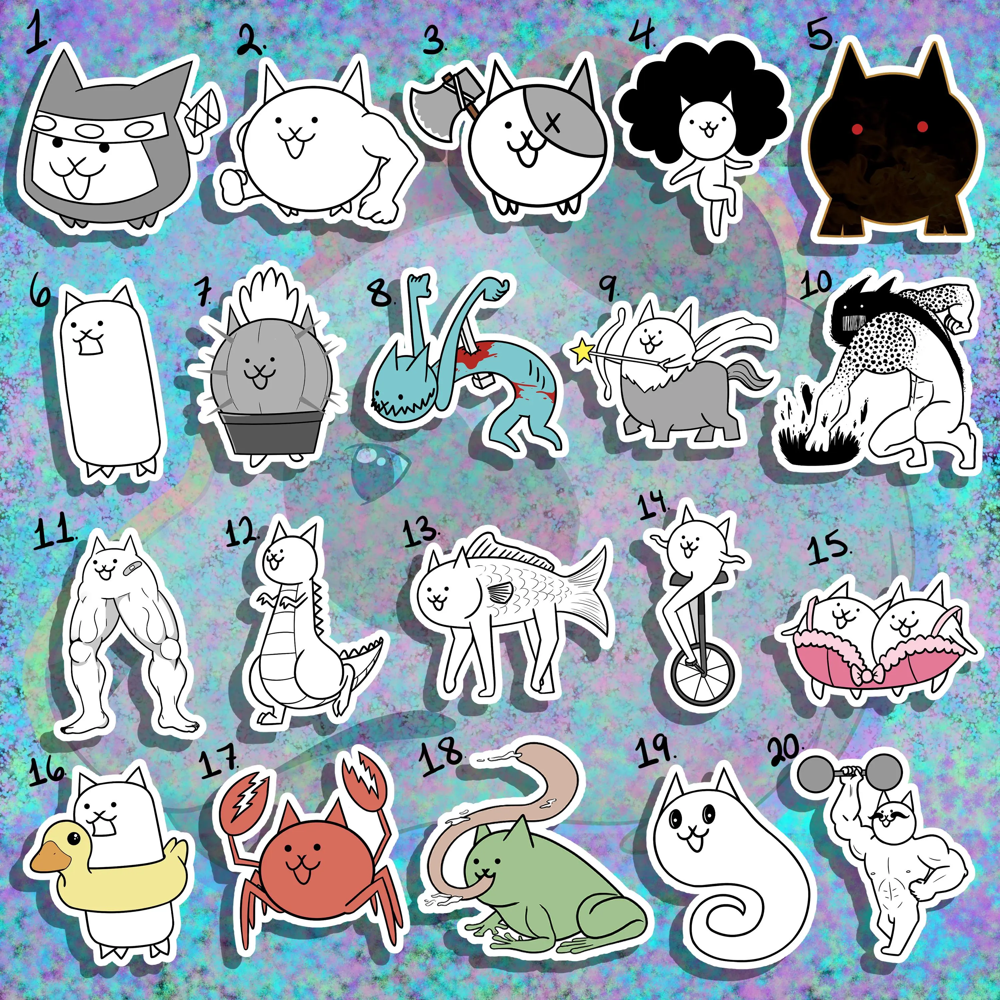
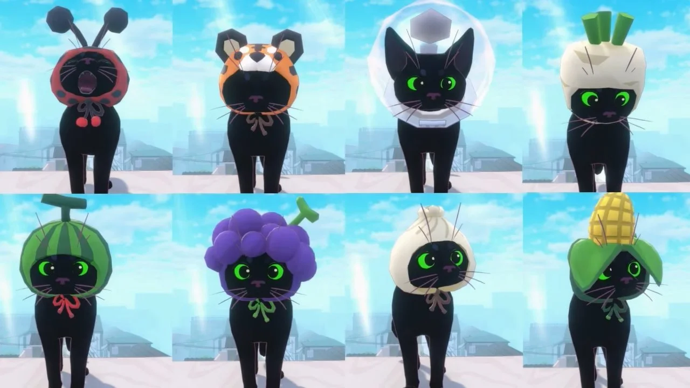
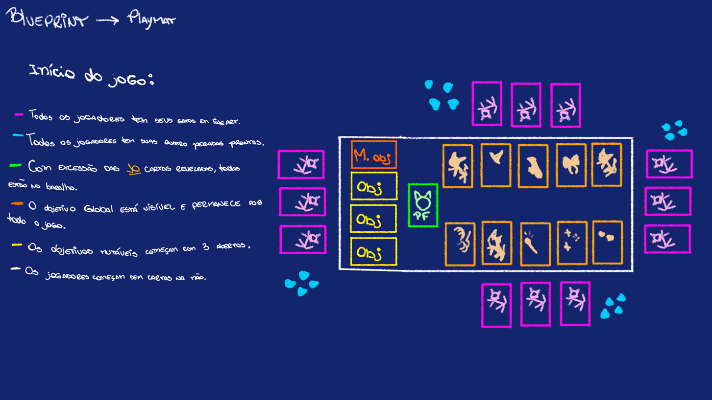
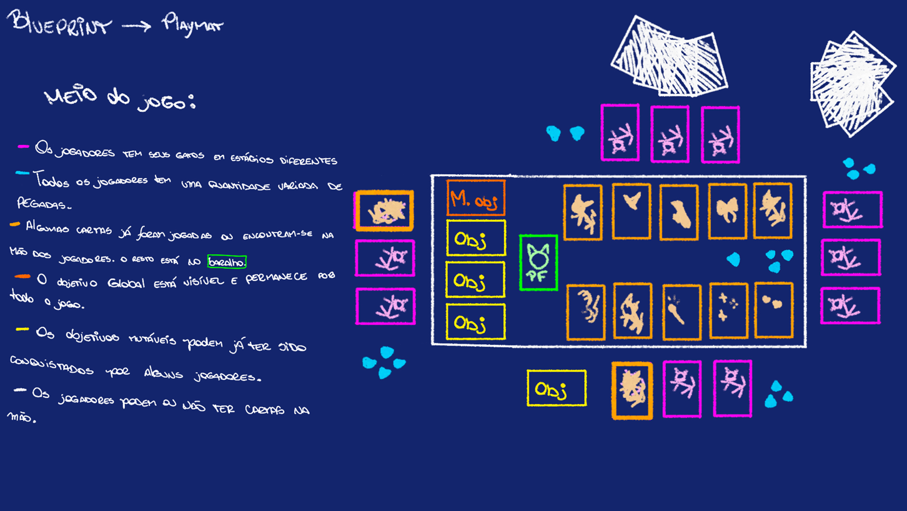
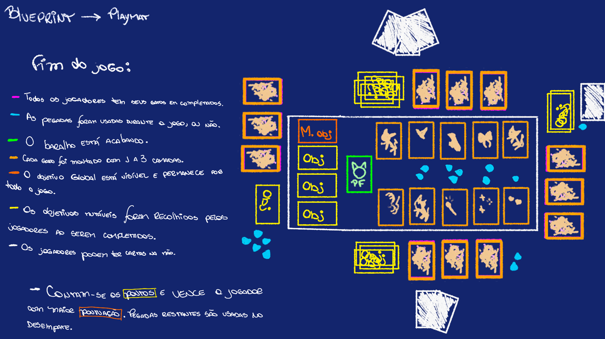

# Purrfect Kitten - Game Design Document (GDD)

> Modelo adaptado do Anexo II do manual *Game é Cultura, Game é Audiovisual* (MinC).

---

## 1. Página de título

### Nome do Game
**Purrfect Kitten**

### High Concept do Game
Jogo analógico de cartas onde o jogador adquire cartas através de draft e monta seus gatinhos em camadas, combinando cartas para cumprir objetivos visuais e temáticos.

---

## 2. Visão Geral

### Gênero
Jogo de cartas analógico, familiar, cozy, cute/kawaii, com foco em coleção, combinação e composição visual.

### Público-alvo
Purrfect Kitten é voltado principalmente para jogadores casuais de board e card games, amantes de gatos e da estética cute/kawaii, pessoas que gostam de customização e construção de conjuntos e grupos que jogam socialmente, buscando experiências leves, charmosas e rejogáveis.

O público tende a preferir jogos rápidos, com forte apelo visual, identidade marcante e potencial de compartilhamento social.

### Game Flow
| Etapa | O que acontece |
|---|---|
| Preparação | São distribuídas na mesa as seguintes cartas: O desafio global da partida e os desafios de trend; As cartas de peças de gato, após embaralhadas, são distribuídas em duas filas de 5 cartas cada deixando um vão entre elas; O baralho de cartas de peça de gato é colocado ao lado do vão entre as cartas. Cada jogador recebe três cartas de lineart de gato, quatro tokens de pegada e um objetivo de conjunto escondido. O jogador com mais gatos (ou o último jogador a interagir com um gato começa). |
| Turno | O jogador pode pegar uma das cartas na ponta da fila mais afastada do baralho sem pagar token nenhum, ou usar seus tokens de pegada para "andar" pela linha entre as duas filas de cartas e comprar uma das cartas do espaço imediatamente à frente dele. Além disso, ele também pode combinar 3 cartas de sua mão para montar um gato e avançar em seus objetivos escondidos ou completar um dos objetivos de trend da mesa. Caso ele conclua um objetivo de trend, ele adquiri aquela carta. |
| Montagem | As cartas transparentes e/ou sobrepostas formam visualmente os gatos com atributos específicos. |
| Pontuação | Os jogadores verificam objetivos cumpridos ao final do jogo e somam pontos. |
| Encerramento | O jogo termina quando todos os jogadores tiverem montado seus três gatos; vence quem tiver mais pontos. |

### Estilo estético
O jogo adota uma estética fofa/kawaii moderna, aconchegante, colorida e fofa. A direção de arte prioriza formas arredondadas, expressões carismáticas e forte apelo de coleção e exibição. Cada gatinho deve parecer um pequeno mascote mágico, único e visualmente recompensador de montar.

---

## 3. Gameplay e Mecânicas

### Gameplay
O núcleo do jogo está na montagem de gatinhos por meio da sobreposição de cartas em camadas. Os jogadores constroem seus gatos combinando base, padrões de pelagem/mutações e acessórios, buscando formar composições visualmente interessantes e mecanicamente eficientes para pontuar com os objetivos da partida.

### Progressão do Game
A progressão acontece ao longo da própria partida, conforme os jogadores completam seus gatos e se aproximam da composição final de um trio. A tensão cresce à medida que os jogadores percebem quantos objetivos de trend os demais já completaram enquanto, ao mesmo tempo, não sabem se eles completaram os seus objetivos escondidos ou não.

### Estrutura de Missões/Desafios
Os desafios do jogo são dados pelas cartas de objetivo. No jogos temos três tipos de objetivo: 
 - Objetivos Globais, eles determinam se os jogadores devem focar em ter atributos diferentes ou repetidos;
 - Objetivos Trending: Combinações de Atributos específicos e temáticos que são distribuídos em 3 pilhas na mesa no início do jogo e coletados pelo jogador ao completá-los;
 - Objetivos de Conjunto (Escondidos), cada jogador recebe um ou início do jogo, eles são referentes ao conjunto de três gatos montados pelo jogador durante o jogo.

### Objetivos
O objetivo do jogador é conseguir a maior pontuação possível em seus gatinhos e/ou conjuntos de gatinhos ao final da partida.

### Mecânicas
As principais mecânicas do jogo incluem:
- Compra e gestão de mão;
- Combinação de cartas;
- Composição visual;
- Coleção de atributos;
- Construção de conjuntos;
- Cumprimento de objetivos;
- Comparação de resultados finais.

Cada carta de camada possui dois atributos. Esses atributos se distribuem em cinco grandes categorias:

- **Tema:** Terror, Infantil, Sci-fi, Drama, Comédia;
- **Paleta:** Vibrante, Pastel, Frio, Quente, Neutro;
- **Vibe:** Fofo, Romântico, Elegante, Selvagem, Sombrio;
- **Origem:** Mitológica, Geek, Natural, Mágico, Cósmico;
- **Celebração:** Carnaval, Páscoa, Festa Junina, Halloween, Natal.

As regras explícitas definem como os gatos podem ser montados e como os objetivos pontuam. As regras implícitas surgem da leitura do melhor encaixe entre cartas, atributos e timing de montagem.

### Movimentação dentro do Game / Física
Como se trata de um jogo analógico de cartas, não há movimentação espacial de personagem. A interação física mais próxima de uma movimentação é o uso de tokens de patas para adquirir cartas mais para frente na fila de compras.

### Objetos
Os principais objetos do jogo são:
- 01x Caixa;

 - INSERIR AQUI APÓS O FIM DAS ILUSTRAÇÕES - 

- 01x Manual;

 - INSERIR AQUI APÓS O FIM DAS ILUSTRAÇÕES - 

- 02x ou 04x Sheet de Referências de Categorias/Atributos;

 - INSERIR AQUI APÓS O FIM DAS ILUSTRAÇÕES - 

- 16x Cartas base com o lineart dos gatinhos;

 - INSERIR AQUI APÓS O FIM DAS ILUSTRAÇÕES - 

- 88x Cartas de camada impressas em transparência;

 - INSERIR AQUI APÓS O FIM DAS ILUSTRAÇÕES - 

- 02x Cartas de objetivo globais;

 - INSERIR AQUI APÓS O FIM DAS ILUSTRAÇÕES - 

- ??x Cartas de objetivo "Trending";

 - INSERIR AQUI APÓS O FIM DAS ILUSTRAÇÕES - 

- ??x Cartas de objetivo de conjunto;

 - INSERIR AQUI APÓS O FIM DAS ILUSTRAÇÕES - 

- 16x Tokens de pegadas.

 - INSERIR AQUI APÓS O FIM DAS ILUSTRAÇÕES - 

As cartas base funcionam como suporte visual para a composição final. As cartas de camada acrescentam cor, padrão de pelagem/mutações e acessórios, além dos atributos usados para pontuação.

### Ações
As ações principais envolvem:
- Comprar cartas de camada;
- Organizar a mão e planejar combinações;
- Montar os gatinhos;
- Verificar os atributos visíveis;
- Cumprir objetivos;
- Contar os pontos ao fim do jogo.

A comunicação do jogo é majoritariamente visual, apoiada por símbolos de atributo e leitura direta das composições.

### Combate
Não há combate. O conflito é indireto, centrado na aquisição de cartas que, por vezes, podem ser aquelas que seus oponentes queriam ou no ato de completar um objetivo que outro jogador estava tentando completar.

### Economia
Até o momento, o jogo não apresenta economia tradicional com moedas ou ouro. Os tokens de pegada, usados para comprar cartas mais próximas do baralho (avançadas) nas filas de compra são o mais próximo que temos de uma economia e nesse caso é um jogo de economia fechada, nunca existem mais do que 16 pegadas em jogo.

### Opções de Jogo
Por enquanto, o jogo apresenta apenas um modo (o modo descrito acima), porém, é possível:
 - Um modo sem pontuação, caso seja necessário tornar o jogo mais casual ainda;
 - Um modo onde o jogo acaba quando o primeiro jogador terminar seu terceiro gato, mesmo que os demais não tenham completado os seus, para tornar o jogo ainda mais competitivo e rápido.

 Tais mudanças podem afetar a duração do jogo além de seu nível de complexidade/desafio.

### Salvar & Replay
Por ser um jogo analógico, não há sistema de save. A rejogabilidade vem da recombinação das cartas e da variedade de objetivos.

### Easter Eggs, Cheats e conteúdo bônus
Algumas cartas trazem referências específicas à cultura geek/nerd, são elas:

 - INSERIR AQUI APÓS O FIM DAS ILUSTRAÇÕES - 

Além das cartas de camadas, alguns objetivos também trazem referências específicas, como:

 - INSERIR AQUI APÓS O FIM DAS ILUSTRAÇÕES - 

---

## 4. Arte do Game

### Elementos Visuais
A direção de arte do jogo é baseada em uma estética cozy + cute, com forte inspiração em universos de customização visual e criaturas colecionáveis. Os gatos devem apresentar:
- Cabeças grandes em estilo cartoon;
- Corpos compactos;
- Pernas curtas e mais gordinhas, estilo chibi;
- Olhos grandes e expressivos;
- Caudas curvas e compridas;
- Formas predominantemente arredondadas.

A leitura visual deve permanecer clara mesmo em formato impresso, considerando o uso em cartas em tamanho 70mm x 120mm para todas as cartas do jogo.

**Paleta de cores:**  

**Inspirações:**  
- Canvas (Cartas com Transparência); 

- KleptoCats (Estilo Silly/Cute); 

- Flight Rising (Manifestação de Padrões e Cores Base); 

- Battle Cats (Mutações e Referências); 

- Little Kitty Big City (Acessórios); 

### Elementos Sonoros
Como se trata de um jogo de mesa, não há sistema sonoro nativo na experiência principal. Eventuais referências de atmosfera podem existir apenas como apoio na ambientação externa da partida.

---

## 5. Narrativa, Ambientação e Personagens

### História e Narrativa
Purrfect Kitten trabalha com uma narrativa leve e temática, centrada na fantasia de criar o gatinho perfeito. Em vez de uma história linear, a proposta valoriza uma fantasia de personalização e curadoria visual: cada jogador monta um trio de gatos estilizados e cheios de personalidade.

### Game World
O mundo do jogo é acolhedor, vibrante, fofo e levemente mágico, funcionando como pano de fundo para a criação desses gatos ideais.

### Visão geral e apresentação visual do mundo do game
A ambientação é menos narrativa e mais estética, baseada em categorias como tema, paleta, vibe, origem e celebração. Isso permite que cada composição sugira um micro-universo visual próprio.

### Áreas do jogo
Por ser um jogo de cartas físico, as “áreas” do jogo são funcionais e físicas:
- Mão do jogador;
- Filas de compras das cartas de camada;
- Área de objetivos;
- Área de Exposição de cada jogador, onde ele exibe seus gatinhos já montados;
- Área de objetivos já concluídos.

### Personagens
Os principais personagens são os próprios gatinhos montados durante a partida. Sua personalidade emerge da combinação de atributos, cores, temas e acessórios.

### Fases (Levels)
Não há fases no sentido digital tradicional. A estrutura da partida se organiza pela montagem progressiva de três gatinhos por jogador até a pontuação final.

- Blueprint: (Start); 

- Blueprint: (Middle); 

- Blueprint: (End); 

### Fase de treino e/ou tutorial
Não há um tutorial em si, mas, o manual vai explicar o jogo com imagens para ilustrar momentos de jogo e como interagir com ele.

---

## 6. Interface

### Sistema Visual
A interface é constituída pelo layout das cartas, lineart base, símbolos de atributos, composição em camadas e leitura visual geral da mesa. O sistema visual precisa equilibrar fofura, clareza e facilidade de leitura.

#### Layout das Cartas
- Cartas da Camada:
 - INSERIR IMAGENS -
- Cartas de Objetivos:
 - INSERIR IMAGENS -

#### Símbolos dos Atributos
 - INSERIR IMAGENS -

### Sistema de Controle
O controle do jogo é manual e físico, feito por posicionamento, sobreposição e manuseio das cartas.

### Sistema de Ajuda
O jogo conta com:
- Manual;
- Folha lembrete dos símbolos de atributos;
- Exemplos de montagem para facilitar o entendimento nas primeiras partidas/rodadas (ilustrados no manual).

---

## 7. Inteligência Artificial (AI)

### Oponentes e AI inimiga
Não se aplica.

### AIs parceiras ou não-inimigas
Não se aplica.

### AI de suporte
Não se aplica.

---

## 8. Aspectos Técnicos

### Plataformas de produção

#### Protótipo:
 - Lápis e Papel.

#### Versão 1.0:
 - Ipad;
 - PC.

### Hardware e Software de Desenvolvimento

#### Protótipo:
 - Folha sultife;
 - Lápis;
 - Borracha;
 - Canetas coloridas.

#### Versão 1.0:
 - Procreate (Ilustrações);
 - Illustrator (Interface e Símbolos);
 - Visual Studio Code (GDD);
 - GitHub (Armazenamento de Informações e Acesso ao GDD).

### Requerimentos de Rede
Não se aplica.

---

## Local e data
São Paulo, 07 de abril de 2026.

## Responsável
Giovanna Saggiomo