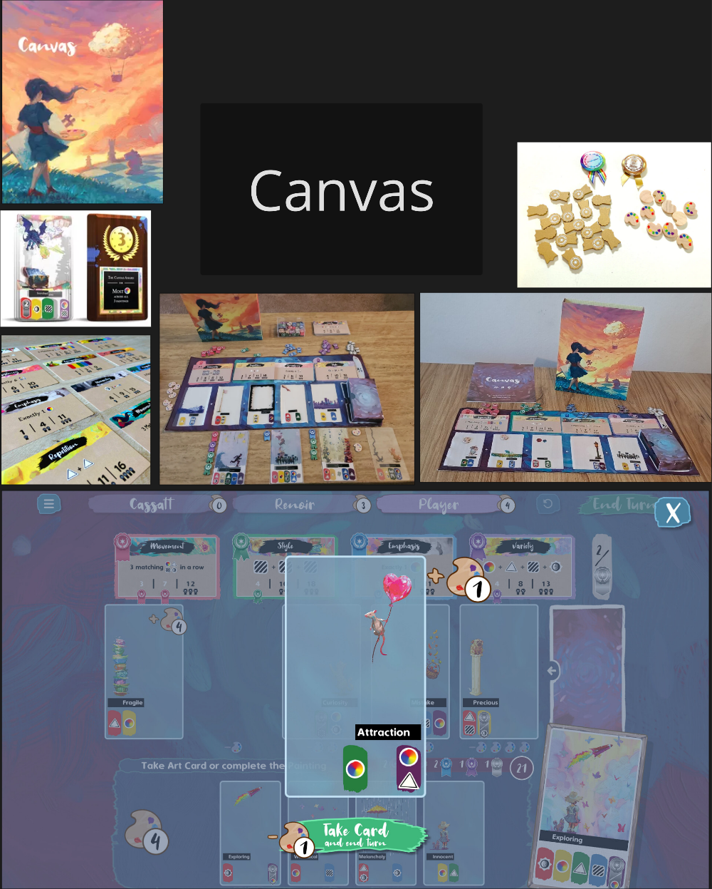

# GDD – Purrfect Kitten

> Versão do documento: 0.1  
> Última atualização: _[28/12/2025]_

---

<!--## Sumário

- [1. Visão Geral / Pitch](#1-visão-geral--pitch)
- [2. Objetivos & Escopo](#2-objetivos--escopo)
- [3. Setup Inicial](#3-setup-inicial)
- [5. Mecânicas, Fluxo de Jogo e Regras](#5-mecânicas-fluxo-de-jogo-e-regras)
- [7. Arte, Tema e Direção de Arte](#7-arte-tema-e-direção-de-arte)
- [10. Prototipagem e Iteração](#10-prototipagem-e-iteração)
- [14. Glossário](#14-glossário)
- [15. Créditos & Histórico de Revisão](#15-créditos--histórico-de-revisão)-->

---

<!-- Nível: Compacto -->
## 1. Visão Geral / Pitch

<!-- Nível: Compacto -->
### 1.1 Nome do Jogo

Purrfect Kitten

<!-- Nível: Compacto -->
### 1.2 Domínio e Tipo de Jogo  
- Jogos Família; 
- Cozy; 
- Cute/Kawaii.

<!-- Nível: Compacto -->
### 1.3 Público-alvo  
- Jogadores Casuais de Board/Card Games; 
- Amantes de Gatos e Estética “Cute/Kawaii”; 
- Jogadores que gostam de Customização e Construção de Conjuntos; 
- Grupos que Jogam Socialmente, que gostam de experiências coletivas com humor e fofura; 

#### 1.3.1 Características comportamentais do público
- Preferem jogos rápidos e rejogáveis; 
- Gostam de colecionar, organizar e montar “builds”; 
- Apreciam estética cute, cozy e identidades fortes nos visuais; 
- Valorizam interação social e humor leve; 
- Tendem a compartilhar fotos do jogo nas redes (alto potencial instagramável). 

<!-- Nível: Compacto -->
### 1.4 Premissa / Fantasia Principal  
No mundo acolhedor e vibrante de Purrfect Kitten, cada jogador tem a chance de criar o seu trio de gatinhos dos sonhos, estilizados e cheios de personalidade. A fantasia central do jogo é a sensação de criar combinações únicas, combinando cartas em camadas que possam transformar esses gatinhos no pet perfeito para você.

<!-- Nível: Compacto -->
### 1.5 Pitch em 2 Linhas  
Construir seu próprio gatinho perfeito em um mundo fofo, mágico e cheio de personalidade. E ainda ser premiado por isso!

<!-- Nível: Intermediate-->
### 1.6 Principais Referências  
- Canvas; 

- Flight Rising; 

<!-- Nível: Completo
### 1.7 Estado Atual do Projeto e Objetivo do Documento  
_(o que já existe: protótipo, teste, versão; para que serve este GDD)_

_(Descrição aqui)_
-->

---

## 2. Objetivos & Escopo  <!-- seção em si é Intermediate, mas contém itens Compactos -->

<!-- Nível: Compacto -->
### 2.1 Objetivo Geral do Jogador  
Conseguir a maior pontuação possível em seus gatinhos/conjuntos de gatinhos.

<!-- Nível: Compacto -->
### 2.2 Tempo Estimado de Partida  
A ser testado, mas, o estimado é entre 30-45 minutos.

<!-- Nível: Compacto -->
### 2.3 Número de Jogadores  
- Mínimo: 2 jogadores.
- Máximo: 4 jogadores.

<!-- Nível: Intermediate-->
### 2.4 Nível de Complexidade  
Jogos Familiares/Gateway.

<!-- Nível: Intermediate-->
### 2.5 Tipo de Experiência Desejada  
Majoritariamente relaxada com pequenos momentos de caos ou competitividade na seleção de cartas.

<!-- Nível: Completo
### 2.6 Escopo Inicial vs Escopo Final  
_(o que é obrigatório vs o que é “nice to have”)_

_(Descrição aqui)_
-->

<!-- Nível: Completo-->
### 2.7 Restrições do Projeto  
O projeto deve estar concluído para entrega no TCC da Pós.

---

<!-- Toda a seção 3 é no mínimo Intermediate, então fica comentada por enquanto-->
## 3. Componentes

### 3.1 Lista de Componentes  
- Cartas base com o lineart dos gatinhos; 
- Cartas de camada impressas em transparência para composição dos gatinhos; 
- Token/Ficha para compra de cartas avançadas na fila do mercado de customização; 
- Token/Ficha para a premiação de cada gatinho ou conjunto de gatinhos; 
- Manual; 
- Caixa.

### 3.2 Quantidade de Cada Componente

<!-- ### 3.3 Especificações Físicas  
*(tamanho de carta, tipo de papel, formato de token, etc.)*-->

### 3.4 Arte / Iconografia por Componente  

#### 3.4.1 Carta base de gatinho
- Lineart do gatinho no centro da carta; 
- Área inferior reservada para os símbolos de origem; 
- Background.

#### 3.4.2 Cartas de camada
- Figura com a adição ao lineart no meio da carta, encaixando com o lineart; 
- Símbolos na área inferior apontando a origem daquela camada/tipo dela.

### 3.5 Versão de Protótipo  
Protótipo inicial deve ser impresso em sulfite visando prototipagem rápida e barata para execuitar o máximo de design loops sem dó de tacar tudo fora se necessário.

---

<!-- Nível: Compacto -->
## 3. Setup Inicial  <!-- era seção 4 no esqueleto original, renumerar se quiser manter 4 -->

<!-- Nível: Compacto 
### 3.1 Preparação da Mesa  
_(como organizar tabuleiros, cartas, tokens, etc.)_

_(Descrição aqui)_-->

<!-- Nível: Compacto 
### 3.2 Distribuição Inicial de Componentes  
_(o que cada jogador recebe ao começar)_

_(Descrição aqui)_-->

<!-- Nível: Intermediate
### 3.3 Ordem de Turno Inicial  
_(ordem fixa, sorteio, baseado em condição, etc.)_

_(Descrição aqui)_
-->

<!-- Nível: Completo
### 3.4 Variações de Setup por Número de Jogadores

_(Descrição aqui)_
-->

---

<!-- Nível: Completo -->
## 5. Mecânicas, Fluxo de Jogo e Regras

<!-- Nível: aqui só vamos expor o mínimo Compacto, o resto fica comentado -->

<!-- BLOCO 5.1 TODO NÃO-COMPACTO
### 5.1 Estrutura de Turno

#### 5.1.1 Fases do Turno  
*(ex.: Compra → Ações → Manutenção)*

#### 5.1.2 Sequência de Jogadas

#### 5.1.3 Ações Permitidas por Turno  
*(lista de ações e restrições)*
-->

<!-- BLOCO 5.2 TODO NÃO-COMPACTO
### 5.2 Mecânicas Principais

#### 5.2.1 Compra / Saque / Draft

#### 5.2.2 Movimentação / Colocação  

#### 5.2.3 Combate / Conflito  

#### 5.2.4 Controle de Território / Áreas

#### 5.2.5 Recursos e Economia  
-->

<!-- BLOCO 5.3 TODO NÃO-COMPACTO
### 5.3 Mecânicas Secundárias

#### 5.3.1 Habilidades Especiais

#### 5.3.2 Efeitos de Cartas / Modificadores  

#### 5.3.3 Penalidades e Bonificações
-->

### 5.4 Condições de Vitória

<!-- Nível: Compacto -->
#### 5.4.1 Como Vencer  
Quando o último jogador terminar de montar as cartas de seu terceiro gatinho, os jogadores todos os expõem em uma exposição de pets e recebem prêmios (pontos) pelos objetivos que cumpriram. O jogador com maior quantidade de pontos vence.

<!-- Nível: Intermediate
#### 5.4.2 Pontuação / Condições Alternativas

_(Descrição aqui)_
-->

<!-- Nível: Completo
#### 5.4.3 Desempate

_(Descrição aqui)_
-->

<!-- Nível: Completo
### 5.5 Exemplos de Turno / Exemplo de Rodada Completa

_(Descrição aqui)_
-->

<!-- Nível: Completo
### 5.6 Erros Comuns e FAQ de Regras

_(Descrição aqui)_
-->

---

<!-- Toda a seção 6 é não-Compacta, então comentada
## 6. Estrutura de Cartas e Outros Componentes

### 6.1 Layout das Cartas  

### 6.2 Hierarquia da Informação  

### 6.3 Tipos de Cartas  

### 6.4 Tokens, Marcadores e Tabuleiros

### 6.5 Wireframes / Mockups de Componentes  

### 6.6 Versões Alternativas / Módulos de Cartas
-->

---

## 7. Arte, Tema e Direção de Arte  <!-- seção Completo, mas tem item Compacto -->

<!-- Nível: Compacto -->
### 7.1 Estilo Visual Geral  
Estética kawaii moderna, criando um universo aconchegante, colorido e fofo. A arte prioriza formas arredondadas, cores acolhedoras e expressões fofas, transmitindo leveza e emoção em cada carta.
O jogo abraça um visual cozy + cute, com personagens que equilibram simplicidade, carisma e espaço para personalização. Cada gatinho deve parecer um pequeno mascote mágico que os jogadores têm orgulho de montar e exibir.

<!-- Nível: Intermediate-->
### 7.2 Paleta de Cor

<!-- Nível: Completo
### 7.3 Silhuetas  

_(Descrição aqui)_
-->

<!-- Nível: Intermediate-->
### 7.4 Moodboard / Referências Visuais

<!-- Nível: Intermediate-->
### 7.5 Referências de Arte (Outros Jogos, Mídias)
- Mystic Moon; 

<!-- Nível: Completo-->
### 7.6 Diretrizes de Arte para Cartas e Tabuleiros

#### 7.6.1 Cartas:
##### 7.6.1.1 Identidade Visual dos Gatos:
Proporções:  
- Cabeças grandes estilo cartoon; 
- Corpo compacto, pernas curtas e traços redondinhos que reforçam a fofura; 
- Olhos grandes e expressivos, com brilho suave; 
- Caudas curvas e volumosas, ajudando na leitura e na silhueta. 

Linguagem de Formas:  
- Formas predominantes: círculos, ovais e curvas suaves; 
- Evitar ângulos agudos ou detalhes muito realistas; 
- Silhuetas claras para fácil reconhecimento em pequeno formato (cartas).

---

<!-- Seções 8 e 9 totalmente não-Compactas, ficam comentadas
## 8. Lore e Ambientação (Opcional)

### 8.1 Universo / Contexto

### 8.2 Facções / Personagens / Unidades

### 8.3 Micro-narrativas / Eventos Temáticos

## 9. Balanceamento & Economia

### 9.1 Custo de Ações e Unidades

### 9.2 Matrizes de Balanço  

### 9.3 Curva de Poder ao Longo da Partida

### 9.4 Probabilidades Importantes  

### 9.5 Estratégias Dominantes, Tóxicas e Inviáveis
-->

---

## 10. Prototipagem e Iteração  <!-- seção Intermediate, mas com item Compacto -->

<!-- Nível: Intermediate
### 10.1 Versões do Protótipo  

### 10.2 Registro de Mudanças  

### 10.3 Regras Temporárias / Alternativas em Teste
-->

<!-- Nível: Compacto -->
### 10.4 Layout de Protótipo  
Iniciar com apenas lineart e sketches pq impressão em transparência é cara. Se controla, Xofana.

---

<!-- Seção 11 inteira não-Compacta, comentada
## 11. Playtests

### 11.1 Plano de Testes  

### 11.2 Checklist de Playtest

### 11.3 Feedback Coletado  

### 11.4 Ajustes Derivados dos Testes
-->

---

<!-- Seção 12 inteira não-Compacta, comentada
## 12. Expansões e Variantes

### 12.1 Modo Solo

### 12.2 Modo Cooperativo / Times

### 12.3 Regras Avançadas

### 12.4 Módulos Opcionais / Expansões Futuras
-->

---

<!-- Seção 13 inteira não-Compacta, comentada
## 13. Produção Física

### 13.1 Especificações de Impressão  

### 13.2 Materiais  

### 13.3 Custos Estimados / Limites de Produção

### 13.4 Versão Print-and-Play
-->

---

<!-- Nível: Compacto -->
## 14. Glossário

- Base: Carta com lineart dos gatinhos; 
- Camadas: Cartas impressas em transparência que acrescentarão as cores e demais detalhes dos gatinhos que devem ser "empilhadas" em cima do lineart.

---

<!-- Nível: Compacto -->
## 15. Créditos & Histórico de Revisão

<!-- Nível: Compacto -->
### 15.1 Equipe
Giovanna Saggiomo: Game Designer e Artista.

<!-- Nível: Compacto -->
### 15.2 Histórico de Versões do Documento  

v0.0 – Esqueleto Criado e MkDocs/Automatização funcionando;
v0.1 – Início do preenchimento das Informações
